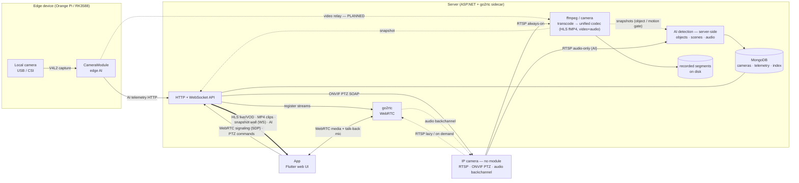

# Architecture

How video and AI move through Serval, and why the pieces are split where they are.



## Two kinds of camera

There are **two kinds of camera**, and every camera's video converges on the Server's **ffmpeg**,
which normalizes it to one codec — the single decode path the whole front end relies on:

- **IP camera (no module):** the Server pulls the camera's **RTSP** directly. Recording, live,
  dashboard, WebRTC and **AI** all run off it. The AI is the *same detection library* the edge
  CameraModule runs, hosted inside the Server, storing the **same telemetry** to MongoDB. A camera
  gets AI whether or not it has an edge device — edge cameras run it locally, module-less cameras
  have the Server run it for them. It is opt-in per camera (`AiVision` / `AiAudio`), because one
  vision model is shared across every camera in the process.
- **Module camera:** a camera attached to an edge device (Orange Pi / RK3588) running the
  **CameraModule**. The module captures the camera locally, runs AI in-process — who's speaking,
  what's said, emotion, audio events, scene descriptions — and POSTs **telemetry** to the Server.
  It does **not** transcode; the camera's *video* still has to reach the Server's ffmpeg. Since the
  camera is local to the edge device, the module must **relay** that video over the LAN — a
  capability that is **not built yet**. Today a module contributes AI only.

Once a camera's video is at ffmpeg (pulled directly, or relayed by a module), the rest is the same
for both:

- **Recording + live (always-on):** one ffmpeg per camera writes **HLS fMP4** segments that *are*
  both the recording and the live stream, plus a ~1 fps JPEG snapshot feeding the multi-camera
  dashboard wall over a single WebSocket. With `RecordAudio` set, each segment carries **video and
  audio in the same file**, and `GET /clip.mp4?from=&to=` exports any range as a standalone MP4.
- **Replay (on demand):** `GET /vod.m3u8?from=&to=` synthesises a playlist over the same segments
  the live view uses, so scrubbing back costs no extra storage and no remux. `GET /coverage?from=&to=`
  says where footage exists — the segment index merged into one span per ffmpeg session, because
  unmerged a day is ~21,600 rows.
- **Low-latency + interaction (on demand):** a **go2rtc** sidecar serves sub-second **WebRTC** for
  the focused view, carrying **two-way talk-back** (mic → camera); **PTZ** is driven over **ONVIF**.
  WebRTC media flows browser ↔ go2rtc *directly*; the Server only proxies the signaling.

The **App** is the front end, reading every feed and all AI output from the Server.

To the Server, a camera is just a **set of source URLs** it pulls — it doesn't care whether that's
a plain IP camera or, in future, a **CameraModule relaying its local camera** over the LAN. That
relay is the one unbuilt piece; its shape and its cost are in the
[CameraModule roadmap](../CameraModule/Serval.CameraModule/README.md#roadmap).

## Streams and roles

The role table and its JSON examples are in the
[Server README](../Server/Serval.Server/README.md#streams-and-roles). What follows is why it works
that way.

**Every role is written out, and nothing is inferred.** Letting `detect` and `live` fall back to the
`record` stream would save a line of JSON and cost far more than it saved: the resolved streams are
not returned by the API, so a camera could be decoding its 4K main stream once a second for
thumbnails, or serving it over WebRTC, with nothing anywhere saying so.

**A stream carrying no roles is accepted, and named in the log.** It is stored and never pulled,
which is how a source is held out of service without losing its address — the alternative was
deleting the stream and typing the URL back in later. The cost is real: that document is also what
a typo in a role list produces, and validation can no longer tell the two apart. So the registry
check names every role-less stream on startup, which answers the same worry one layer out. It keeps
its `transcode` too, inert, for the reason a camera keeps its audio thresholds while `aiAudio` is
off.

**`recording` is a field on the camera, not a role edit.** Switching it off stops the recorder while
leaving the `record` role exactly where it is, so turning it back on is a switch rather than a
decision about which stream gets the job — and on a camera whose main stream carries only `record`,
the switch is the difference between pausing and deleting a stream. It defaults to true and may not
be true with no `record` stream, so it can never be on and mean nothing; the two ways to keep
nothing stay distinguishable in the document even though nothing downstream of
`StreamIngestManager` distinguishes them.

Splitting detection off is what decouples its cost from recording quality. Snapshots require a full
decode of whatever they come from, so pointing `detect` at a 640×360 sub stream leaves the recorder
a pure copy while motion, the vision model and the dashboard get the same frames for a fraction of
the work. The trade is one more concurrent session on the camera; budget models cap how many they
will serve.

**`record` is optional, and the other two are not.** The asymmetry is about cost, not importance.
Detect and live are free to assign — any stream can carry either — so requiring them keeps the
dashboard wall and the focused view working for every camera at no charge. Record is the only role
that consumes disk, and "watch this and tell me, but keep nothing" is a real configuration: a
doorbell you only want notified about, a camera pointed somewhere that must not be archived, a
temporary camera that should not eat the retention budget. With nothing being recorded — no `record`
role, or `recording` off over one — the camera runs `FfmpegSnapshotSession` alone: one cheap
process, no segments, no index. `recordAudio` becomes inert either way, and `retentionDays` too once
there is no `record` stream at all; with the role still assigned it keeps expiring what is already
on disk, so it is still the dial for the footage the camera is holding. The registry check reports
all of this rather than leaving it to be noticed.

**Sources** may be `rtsp(s)://`, `http(s)://` (including HTTP-FLV), `rtmp(s)://`, `srt://`, or a
local file path, which is looped in realtime as a hardware-free test camera. The scheme decides
ffmpeg's input flags — `-rtsp_transport tcp` is an RTSP-demuxer option and makes ffmpeg exit
outright on any other protocol — so it is validated up front rather than discovered at runtime.

## Cameras that cap concurrent RTSP sessions

With server-side AI audio on, a camera holds two sessions permanently: the recording session
(video, plus audio when `RecordAudio` is set) and an audio-only AI session. A separate `detect`
stream makes that three. go2rtc adds one more, but only while a WebRTC viewer is connected — it
pulls lazily and no streams are configured statically.

This costs the camera no extra *encoding* — an IP camera encodes once into an internal buffer and
RTSP clients are subscribers to it — and `-allowed_media_types audio` means the AI session never
makes it packetize or send video. What it does spend is a session slot, and budget cameras that
allow only two will then refuse the WebRTC viewer. If you hit that: turn `RecordAudio` off (the
recording session then carries video and the AI session audio, one track each), disable
server-side AI for that camera, or accept that the focused live view is unavailable.

Two shapes that look like fixes and aren't. Teeing AI audio off the recording ffmpeg as a second
pipe means a stalled reader backpressures the muxer and takes recording down with it — see
`FfmpegAudioSession`. And fronting ingest with go2rtc makes the sidecar a single point of failure
for recording while forcing it out of lazy mode, so the camera session you save is spent keeping
go2rtc permanently connected.

## Inside the CameraModule

```
PortAudio callback (realtime thread)   AudioCaptureWorker
   └─ int16→float, copy, return        ← must never allocate, lock, or infer
        │
        ▼  AudioRingBuffer (lock-free SPSC)
   VAD thread                          SpeechDetectionWorker
   ├─ tees EVERY window to the conversation WAV   ← never gated: a hole would shift
   │        │                                       every later diarization offset
   │        ▼
   │  ConversationTracker ──▶ DiarizationWorker  (own thread)
   │  (ends on silence)       └─ ConversationReprocessor: pyannote over the whole
   │                             exchange, then live transcripts re-attributed to
   │                             the corrected turns  (ASR only where a turn straddles)
   │                                   ▼
   │                          diarization + conversation_transcript
   │
   └─ AudioLevelGate  ── RMS + pre-roll + hangover   ← skips Silero on a quiet room
           │
           ▼  Silero v5, 512-sample windows  → emits utterances
        ▼  Channel<CapturedSpeech> (bounded, DropOldest)
   Inference (single consumer)         InferenceOrchestrator
   └─ SenseVoice: text + emotion + event      ~0.1s
        │         ├── SpeakerLabeller → live speaker         ~50-100ms
        │         └── requests a refresh, attaches the latest description, never waits
        │                    │
        │            SceneDescriptionService  ←── VisionDescriptionWorker  (own thread)
        │                    ▲                         └─ Qwen3-VL over mtmd, N frames  ~6s
        │                    │                                ▼
        │                    │                          scene record
        │            VisionCaptureWorker
        │            └─ V4L2 MJPEG → FrameRing (last N frames)
        │               └─ JpegMotionDetector  ← the other request source, and the
        │                                        only one that fires with nobody talking
        ▼
   SQLite + WAL                        TelemetryRepository  (durable outbox)
        │
        ▼  ITelemetrySink              TelemetrySyncWorker → FileTelemetrySink (JSONL)
```

Everything from the ring buffer inwards is `Serval.Ai`, shared with the Server. The workers here
are the edge-specific wiring around it: a microphone, a V4L2 camera, and a durable outbox.

Three invariants worth preserving:

1. **Nothing heavy runs on the PortAudio callback.** It copies into the ring buffer and
   returns. Inference there causes dropouts, badly so on the Pi.
2. **Audio never depends on vision.** No camera, a slow model, or a failed description all
   leave transcription untouched.
3. **The audio path never awaits a description.** Vision is ~1000x slower (rtf 0.02 versus
   ~6s per image). It is requested, not waited on.

Backpressure is bounded end to end: the ring buffer drops (and counts) samples on overrun,
the utterance queue drops oldest, and vision requests drop rather than queue. Memory stays
flat on an 8 GB board.

The frame path has no image library in it at all. The camera emits MJPEG, so frames are
already JPEG and go straight into the model — no decode, no re-encode. Truncated frames
(routine right after streaming starts) are discarded rather than described.
