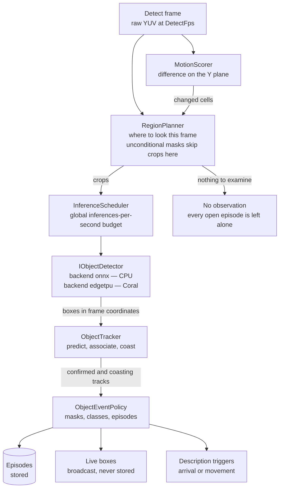
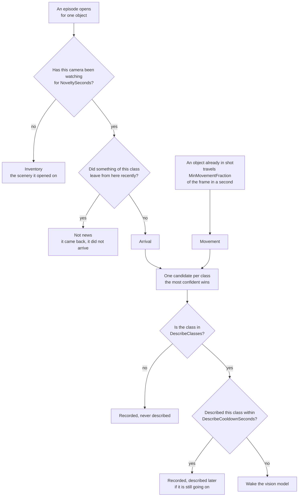
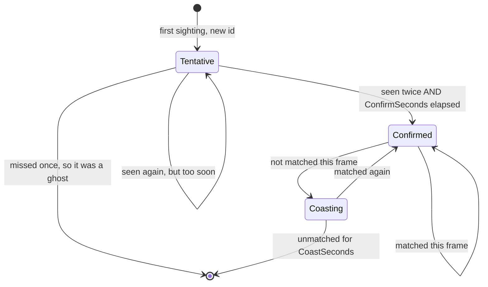
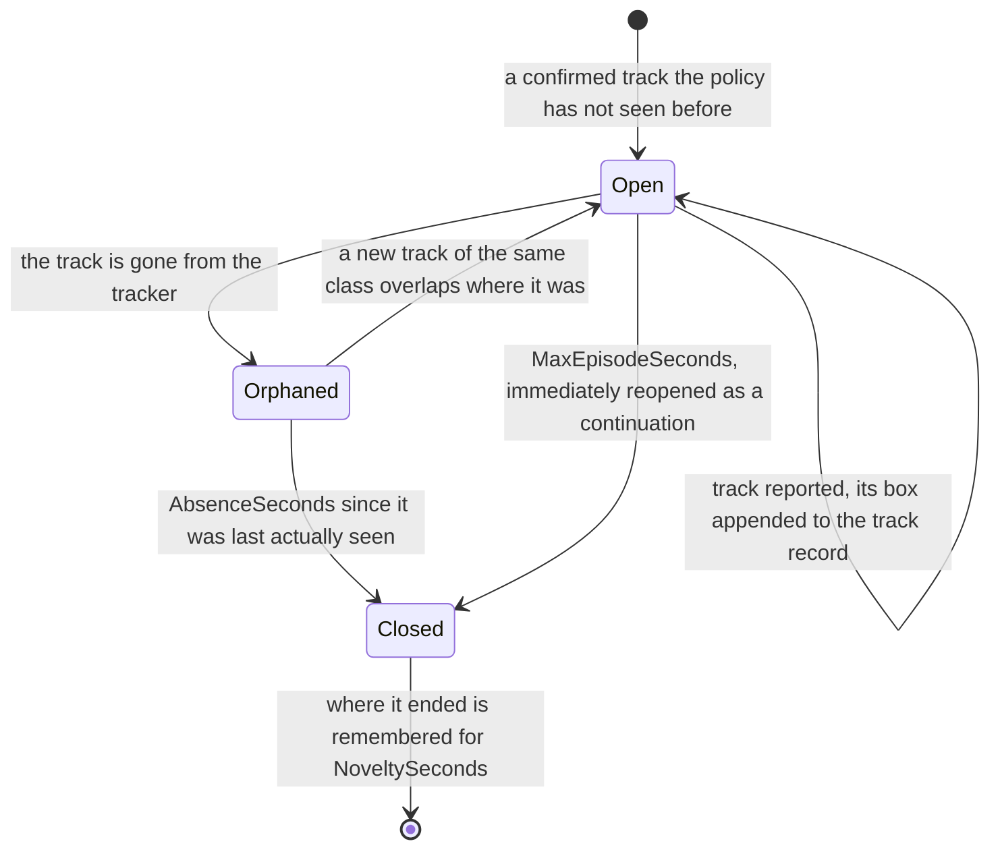

# Detection

The detection code lives in [`Shared/`](../Shared/) and is referenced by both the Server and the
CameraModule, so the two produce comparable results from the same weights and the same prompts.

`Shared/` splits three ways: `Serval.Ai.Core` (the pure gate logic and the seams, no native
dependencies, unit-testable on a fresh clone), `Serval.Ai` (the sherpa-onnx and LLamaSharp
implementations), and `Serval.Contracts` (the telemetry documents, declared once for both sides).

The house rule throughout: **a capability either runs a real model or reports nothing.** Never add
a mock that emits plausible-looking output — a fake transcription is indistinguishable from a
broken deployment.

## The gates

Cheap gates stand in front of the expensive models, which is what makes detection affordable across
many cameras:

| Gate | Guards | How |
|---|---|---|
| **Objects** | the vision model (seconds of CPU per description) | A detection model on the camera's frames, reporting what is *present*. A description is asked for when something arrives or when something already in shot moves. |
| **Motion** | the same, on hosts with no detection model | Frame differencing on a downscaled luma plane. A near-total change is *rejected* rather than reported — that is the IR-cut filter or a light switching on, not movement. |
| **Sound level** | the VAD (an ONNX pass on every 512-sample window) | RMS threshold with pre-roll and hangover, so it opens before speech starts and closes well after it ends, and never cuts an utterance. |

**The two vision gates are alternatives, not a chain.** `Serval:Ai:Detection:Enabled` chooses;
off — the default — leaves the motion gate exactly as it was.

Where a detector *is* loaded, motion does not disappear — it changes job. It stops deciding
**whether** to look and starts proposing **where**, which is the only use for it that survives having
something better at answering the first question. See [Where the detector looks](#where-the-detector-looks).

All of them are pure functions with no native dependencies (the detector's *policy* is; its model
is not), so they are unit-tested on a fresh clone with no models fetched. That is also why they live
in `Serval.Ai.Core` rather than beside the models they guard: the code that decides whether
the expensive models run at all is the code most worth being able to test cheaply.

### Why detection replaces motion rather than filtering it

A detector reports **state** — what is there. A frame difference reports **change**. Only the first
can express "a person has been at the door for forty seconds", because on a change-driven sample
"nothing is there" and "nothing was looked at" are the same observation, and every duration derived
from it is then wrong. It also sees the case frame differencing structurally cannot: something
present but not moving. A parked car produces zero frame difference forever.

Measured over 5.5 hours of two real cameras at three times of day, the motion gate asked for 57
descriptions and the object gate for 4 — with every one of the 53 differences inspected by hand and
found to be road traffic behind the property, headlight glare on an empty drive at dawn, or a pet.
None was a person.

### One frame, end to end

What happens to a single detect frame, on a host where a detection model is loaded. Each stage has
its own section below.



The branch to **No observation** is the one worth reading twice. When the planner asks for nothing,
the policy is not told anything at all — because "the detector looked and found nothing" and "nobody
looked" have to stay different observations. Conflating them is how a subtractive motion gate ends up
closing a parked car's episode and reporting that it left.

Note also what motion does *not* do here: nothing downstream is skipped because it was quiet. Motion
only adds places to look.

**The device is a standing per-host choice, not a migration.** `Detection:Device` names a runtime and
a piece of silicon together — `onnx-cpu`, `tflite-edgetpu` — and the runtime half selects a sibling
implementation of `IObjectDetector`. Every one that gets built stays supported: a host with no
accelerator runs `onnx-cpu` indefinitely, and that is a supported deployment rather than a waiting
room. **Both runtimes are built**, and the settings page greys out whichever devices the host and
image cannot actually deliver. Everything above the interface is unaware of which is loaded,
which is the whole reason the seam is there — see [coral.md](coral.md) for the accelerator's own
deployment.

### Where the detector looks

A model's input is a few hundred pixels square; a frame is not. Fitting a 1280x720 frame into a 320²
input throws away three quarters of every linear dimension, so a person 60 pixels tall in the frame
arrives 27 pixels tall — under what a small detector can find. The same person inside a crop taken at
the frame's own resolution arrives around 200 pixels tall. **That is the whole argument for regions,
and it is about recall, not speed.**

So on each frame `RegionPlanner` builds a short list of places to look:

1. **The floor** — the whole frame. **How often depends on whether crops are on, and this is the
   single most consequential thing in the planner.** With crops off it is *every frame*; with them on
   it drops to once every `Regions:FloorSeconds`, and motion and track crops carry the time in
   between. Where `Regions:TiledFloor` is on and the camera is squeezed enough to earn it, the pass
   becomes a native-scale sweep: run whole on every frame if it is at most `Regions:SweepAtOnce`
   tiles, otherwise one tile per frame on the `FloorSeconds` interval. See
   [the tiled floor](#a-region-has-a-ceiling-a-floor-and-a-magnification-limit) and `coral.md`.
2. **Tracks** — a crop around each live track's predicted position, whether or not anything moved
   there, so something already known about keeps being seen after it stops moving.
3. **Motion** — a crop around each cluster of changed cells, at native resolution, capped by
   `Regions:MaxPerFrame` and filtered by `Regions:MinCells` so a leaf does not earn one.

**Retention and acquisition are separate mechanisms and the planner needs both.** Track crops keep
known objects alive but can never find anything new; the floor finds new things but is far too
coarse to hold a subject's identity between its intervals. With no track crops, a stationary object
is examined once every `Regions:FloorSeconds` — measured on five real cameras, that meant every
parked car's track dying inside `Tracking:CoastSeconds`, its episode surviving only because
`ObjectEventPolicy` kept rejoining it.

**The floor is not a formality, and it is what separates this from a motion gate.** Skipping frames
entirely whenever nothing moved would make "nothing is there" and "nothing was looked at" the same
observation — and `AbsenceSeconds` would then close the episode of a parked car because nothing moved
near it, recording that it left while it sat in the drive. It also acquires what a motion gate
structurally cannot: something that arrived while motion was blind (during an IR-cut flip, where a
whole-frame change is correctly rejected as *not* movement) and has not moved since. A planner that
proposes nothing returns nothing, and the policy is not told — an observation nobody made must not
close an episode.

#### The floor has to be able to confirm a track on its own

The rule that ties the planner to the tracker, and the one that is easiest to break without noticing:
**a subject must be examined on enough *consecutive* frames for a track to confirm.** `ObjectTracker`
drops a tentative track the moment one frame passes without matching it, and will not confirm before
`Tracking:ConfirmSeconds` — 1.0 s, so three consecutive frames at 2 fps. A schedule that looks
somewhere else in between produces no episodes at all, however good each individual look was.

That divides floors into two kinds, and it is worth knowing which one a camera has:

| Floor | What a still subject waits | Acquires on its own? |
|---|---|---|
| Whole frame every frame (crops off) | `ConfirmSeconds` | Yes |
| Sweep of at most `SweepAtOnce` tiles, run whole every frame | `ConfirmSeconds` | Yes |
| Whole frame every `FloorSeconds` (crops on) | up to `FloorSeconds` + `ConfirmSeconds` | Only with motion crops alongside |
| Sweep spread one tile per frame | up to `FloorSeconds` + the sweep | Only with motion crops alongside |

The bottom two are not defects — they are the trade a camera makes when a crop is genuinely a close-up.
They become one when a camera is moved into them for no gain, which is what `AutoMinRatio` at 1.5 and
`SweepAtOnce` at 2 prevent. `AcquisitionTests` asserts the budgets in that table by driving the real
planner against the real tracker: this is a property of the two together, and each is correct alone
while the pair detects nothing.

**Crops only pay when frames are much larger than the model's input**, and the governing number is
just the ratio of the two:

| Detect frame | Model input | Gain on a distant subject | Verdict |
|---|---|---|---|
| 1080p | 320² | ~3.4x | clearly worth it |
| 720p | 320² | ~2.25x | worth it |
| 1080p | 640² | ~1.7x | worth it |
| 640x360 | 512² (a compiled accelerator graph) | 1.25x | not worth it — see below |
| 720p | 640² | ~1.1x | pointless |

`Regions:AutoMinRatio` is where that verdict is drawn, at 1.5x. **The gain is the whole of what a crop
can honestly deliver**, because `Regions:MaxRegionScale` holds a crop's scale at 1.0 —
see [the magnification limit](#and-a-magnification-limit-which-is-the-one-that-bites).

**Why the 1.25x row is declined, which is not obvious.** Two things follow from holding a crop to native
scale. The smallest crop on such a camera is the detector's own input — 512x360 out of a 640x360 frame,
four fifths of the picture, which is not a close-up. And turning crops on moves the whole-frame pass
from every frame to once per `FloorSeconds`. Spending the acquisition guarantee on that is a straight
loss, measured as one: on a real fleet it took a driveway's episode count to zero.

Such a camera wants native scale *without* the schedule change, which is `Regions:TiledFloor` —
it replaces the whole-frame pass rather than thinning it.

#### What this is actually worth, measured

Three minutes of a real driveway, 4K HEVC, against YOLO26n at 640². A landscaper's flatbed truck is
parked up the street; a person in dark clothing is working at the back of it.

| Route | Truck | Person |
|---|---|---|
| whole frame, 640x360 source (a typical sub stream) | not found | not found |
| whole frame, 1280x720 source | **0.18** | not found |
| whole frame, 4K source | **0.17** | not found |
| 640² crop of the 1280 frame | **0.50** | not found |
| 640² crop of a 1920 frame | 0.37 | **0.16** |
| 640² crop at native 4K | **0.84** | not found |

Three things fall out of that, and only the first was expected:

1. **Cropping is worth a lot.** The truck goes from 0.18 to 0.84. At the default `ScoreThreshold` of
   0.25 that is the difference between a parked vehicle being invisible and being found confidently.
2. **Source resolution does almost nothing for whole-frame detection.** 0.17 at 4K against 0.18 at
   720p — because both are squeezed into the same 640² input, so the extra pixels are discarded
   before the model sees them. *A bigger detect stream only pays if something crops.* This is the
   single most useful thing in the table.
3. **A crop can be too tight.** A 200x200 crop at native 4K, centred on the person with the subject a
   comfortable 53 pixels tall, returned **nothing at all** — not the person, and not the truck
   filling half of it. Cutting an object in half destroys more than the magnification recovers, which
   is what `Regions:MinSizeFraction` exists to prevent.

A caution from the same run: the model reports a *person* at 0.11-0.20 on a flowering plant in the
border, and grows **more** confident as resolution rises. Higher resolution amplifies false positives
exactly as readily as real ones, which is why `Tracking:ConfirmSeconds` matters more than any of
this.

Measured again with crops on, on four minutes of a real drive: a **lamp post** 6.7 x 13.5 px in a
1920-wide frame was reported as a person five separate times, at up to **0.41** — where the same
footage with crops off produced no person detections at all. The crop had magnified a seven-pixel
artefact until the model was sure of it.

**No confidence floor separates that from what the crops were there to find**, because the distant
cars scored 0.49 to 0.57 and raising the threshold past 0.41 would have cost them. `ConfirmSeconds`
does not help either: the lamp post is static, so it confirms perfectly. What separates them is
size — the lamp post covered 0.000044 of the frame against the cars' 0.000496, an order of magnitude
apart. That is what `Detection:MinObjectFraction` is for, and it is off by default because how much
distance a camera should give up is a fact about the site. See
[what else is per camera](#what-else-is-per-camera).

`Regions:Mode` is `auto` by default and decides from that ratio, logging which way it went and why on
the first frame — because `auto` quietly resolving to *off* is otherwise invisible, and raising
`Detection:InputPixels` toward the frame's own size is exactly the change that would cause it. `on` and
`off` override. With crops off the planner returns the whole frame on the floor interval and nothing
else, which is byte for byte the behaviour of a detector with no region support: the same
crop-resize-detect path, with a crop that happens to be the whole picture.

#### Crops are grown to the detector's aspect

A tile is built at the detector's own shape, so it arrives at scale 1.0 with no padding. A crop is
sized from the **frame** — `Regions:MinSizeFraction` of its width and height — so it inherits the
frame's aspect and is then letterboxed into an input of some other shape, with the remainder filled
with flat grey. On a camera whose aspect is far from its detector's, that remainder is most of what
the model is shown.

Tested on a 1536x432 32:9 camera against a fixed 320² input:

| Region kind | Size | Scale | Input filled |
|---|---|---|---|
| `Tile` | 320x320 | 1.00x | 100 % |
| `Track`, `Motion`, as sized from the frame | 384x108 | 0.83x | **28 %** |
| The same crop grown to the input's aspect | 384x384 | 0.83x | **100 %** |

**Growing it is free, which is the whole argument.** The scale is set by whichever axis is squeezed
hardest — 0.83x across against 2.96x down — so the slack axis can be filled at no cost in resolution
and no extra inference. The identical 0.83x, with three and a half times more real picture in it. It
also supplies the context the tight-crop failure in `Grow` warns about: 108 pixels of height around a
71-pixel subject is barely any, and this is where more comes from.

Only ever grown, never trimmed — shrinking an axis would cut away the subject the crop was taken for
— and clamped to the frame, so a 432-pixel-tall frame simply gives what it has.

**No backend branch, because it self-cancels.** The condition is not "is this a Coral" but "does the
crop's aspect differ from the input's". That is true of the Edge TPU's fixed 320² and of any static
ONNX export, and close to false on the dynamic per-camera shapes described in
[export with dynamic axes](#export-with-dynamic-axes-and-let-each-camera-pick-its-own-shape), where the
input already tracks the camera's aspect. A crop already at the input's aspect is returned untouched,
so the rule costs nothing where nothing is needed.

The aspect reaches the planner as a bare ratio, the way `cropping`, `floorTiles` and `maxRegion` do —
`RegionPlanner` states twice that it has no business knowing about detectors, and a number it can apply
without knowing what produced it keeps that true.

**It composes with the ceiling below rather than fighting it.** The bound carries the input's aspect
too, so growing the slack axis to that ratio lands at most on the bound's own value for that axis: a
crop inside the bound cannot be shaped out of it. Shaping happens before any oversized region is cut,
since a piece is already the bound's shape and it is the region it came from that decides coverage.

**And it cannot breach the magnification limit either**, for the simpler reason that shaping only ever
grows: a crop already at or above the limit's floor stays there. The floor is applied first, in the same
`Fit` that grows a crop to `MinSizeFraction`, so a track crop and a motion crop of the same subject are
bounded identically — which is the invariant `Fit` exists for.

### A region has a ceiling, a floor, and a magnification limit

Three guards, in two different units, answering three different questions. Confusing them is easy and
the units are why:

| Guard | Default | Units | Stops |
|---|---|---|---|
| `Regions:MinSizeFraction` | 0.25 | fraction of the frame | a crop too tight to hold the object *and its surroundings* |
| `Regions:MaxRegionScale` | 1.0 | scale against the input | a crop being **enlarged** — resolution that is not there |
| `Regions:MinRegionScale` | 0.5 | scale against the input | a crop so large it is shrunk past where the model invents things |

`MinSizeFraction` and `MinRegionScale` are *not* a pair, despite reading like one. The first is a share
of the frame and cannot express "too tight for this detector"; the pair in the same units is
`MaxRegionScale` and `MinRegionScale`, which bracket the scale a region may reach the input at.

`Regions:MinRegionScale` stops a region being so large that it has to be shrunk past the point where the
detector is reliable. Below that point a small model does not merely miss things — it invents them.

Tested on an SSD MobileDet at 320² on an Edge TPU, against a static garden ornament on a 1536x432
camera, varying nothing but how far the region enclosing it was shrunk to reach the input. Six live
frames at each scale:

| Region | Scale | Object arrives | Frames calling it a person |
|---|---|---|---|
| 320x320 sweep tile | 1.00x | 85x71 px | none |
| 384x384 shaped crop | 0.83x | 71x59 px | none |
| **427x432** | **0.75x** | 64x53 px | **none** |
| 484x432 | 0.66x | 56x47 px | 1 of 6 |
| 533x432 | 0.60x | 51x43 px | 4 of 6 |
| 640x432 | 0.50x | 43x36 px | 2 of 6 |
| 1152x324 | 0.28x | 24x20 px | every frame, 0.49 |
| 1536x432 whole frame | 0.21x | 18x15 px | every frame, 0.58 |

It reads the object correctly until it arrives below roughly sixty pixels, then invents a person and
grows *more* confident the smaller it gets.

**The default is 0.5, and it is the runaway guard rather than a safety line for any one model.** What
it has to stop is the merge chain below, where a region grows to cover most of the frame and is
examined at a quarter scale — 0.5 ends that on any backend for almost no cost. The table above is one
320² SSD on one object; EfficientDet-Lite1 and Lite2 were both clean on the same 640x432 region where
it was not, so shipping 0.75 as everyone's default would buy them nothing and cost inference.

**Tune it per deployment, and expect to.** A fixed-input accelerator model on an ultrawide camera is
the hard case and wants 0.75; a dynamic-shape ONNX export on the same camera does not.
`deploy/examples/docker-compose.intel-coral.yml` carries the measured value for the Coral fleet.

**The boundary is not sharp, and one frame will not find it.** A single frame first put it at 0.5;
six frames put 0.5, 0.6 and 0.66 all in the failing range, and the counts are not monotonic between
them. Anything derived from this needs a batch of frames across the day's light rather than a fixture,
and the same is true of any future model swap measured the same way.

#### And a magnification limit, which is the one that bites

The ceiling above is about crops that are too *large*. The limit below is about crops that are too
*small*, and it reaches far more cameras — because a crop smaller than the detector's input has to be
enlarged to fill it, and enlarging is interpolation. It adds pixels, not detail.

Measured on a 640x360 sub stream, a car found in **all sixty of sixty** whole frames at 0.906 mean
confidence, varying nothing but how tightly the crop around it was taken:

| `MinSizeFraction` | Crop scale | Found again | Mean confidence |
|---|---|---|---|
| whole frame | 1.00x | 60 of 60 | 0.906 |
| 0.80 | **1.25x** | 60 of 60 | **0.918** |
| 0.75 | 1.33x | 60 of 60 | 0.862 |
| 0.70 | 1.43x | 59 of 60 | 0.710 |
| 0.65 | 1.54x | 59 of 60 | 0.680 |
| 0.60 | 1.67x | 59 of 60 | 0.649 |
| 0.50 | 2.00x | 27 of 60 | 0.420 |
| **0.25** | **2.75x** | **none** | — |

Monotonic, and past about 1.25x every crop is worse than not cropping at all. The gentlest one is the
only one that beats the whole frame, and it does that by trimming letterbox padding rather than by
magnifying.

**Why `MinSizeFraction` cannot express this.** It is a share of the frame, so what it means in scale
depends on the camera:

```
crop scale = 1 / (Gain x MinSizeFraction)
```

At the default that is `4 / Gain` — so the smallest crop is *enlarged* on every camera under 4x gain,
which is nearly all of them. `Mode = Auto` admits from 1.5x upward, so most of the admitted range was
inside the enlarging band. Note the closed form assumes the crop is not clamped to the frame; where it
is, the real figure is gentler, which is why the 640x360 measurement above shows 2.75x where the
formula says 4.0.

`Regions:MaxRegionScale` states the guard where it belongs, against the input:

- **1.0, the default** — a crop is never enlarged, only ever shrunk.
- It **costs no magnification that was ever real.** A crop's magnification over the whole-frame pass is
  its scale divided by the whole frame's fit, so holding scale at 1.0 leaves the maximum at exactly
  `Gain`: all of the detail the camera has over the input, and none of the invented kind.
- It **clamps to the frame**, and usually holds anyway. A 512x512 floor on a 640x360 frame gives
  512x360, which still reaches a 512x512 input at 1.00x — because a region's scale is the *minimum*
  over its two axes, so clamping the slack one costs nothing.
- The one case it cannot honour is a frame smaller than the input on **both** axes: the whole picture
  is already being enlarged before any crop is cut. The per-camera startup line says so in as many
  words, because it means the deployment has given that camera a larger input than it has pixels for.

What it changes, per camera:

| Frame → input | Gain | Crop before | Scale | Crop after | Scale |
|---|---|---|---|---|---|
| 1536x432 → 512² | 3.0 | 384x384 | 1.33x | **512x432** | **1.00x** |
| 1920x1080 → 640x384 | 3.0 | 480x288 | 1.33x | **640x384** | **1.00x** |
| 640x360 → 512² | 1.25 | 160x160 | 3.20x | **512x360** | **1.00x** |
| 3840x2160 → 640x384 | 6.0 | 960x576 | 0.67x | 960x576 | **unchanged** |

The 4K row is the compatibility guarantee: where `MinSizeFraction` already floors the crop above the
input, the limit has nothing to add. It is also where the remaining headroom is — that camera has 6x of
real detail and takes 4x, so `MinSizeFraction` is what caps it now. Lowering that is safe under the
limit and wants its own measurement.

**What went wrong without it was a runaway, not a near miss.** A union is itself a region, so unions
chain: three subjects spread across a wide frame are enough, because the first union reaches far
enough to overlap the third crop. Over four minutes of trace on the 1536x432 panoramic, **every one
of 479 retention crops that found something was between 1244 and 1536 pixels wide** — median 1280,
a quarter-scale look at nearly the whole frame, where the crop for one tracked object should have
been 384. And it sustained itself: at that scale the detector invented people, which started tracks,
which proposed crops, which merged.

Three rules, in this order:

1. Each tracked object gets its own crop, grown to `MinSizeFraction` as before.
2. Overlapping crops merge **only if the union still fits the bound**; otherwise they stay separate.
3. Anything still oversized *on its own* — a cluster covering half the scene, with nothing merged
   into it — is cut into overlapping pieces that fit, by the same `DetectorShapes.Tiles` the floor
   sweep uses.

**The bound is on merging, not a cleanup afterwards**, and the order is the point. Splitting first
and merging second would glue the pieces straight back together. There are two merge passes — one
building track crops, one adding motion crops to the same list — and both take the bound, which is
what makes the invariant hold: *no region handed to the detector is ever larger than the bound.*

**Pieces keep the reason they were cut from.** `InferenceScheduler` reserves `Floor` and `Tile`
outside the budget and never sheds them, on the strength of each being one inference per camera per
frame. Calling these tiles because they are tile-shaped would let one camera emit several unsheddable
inferences in a frame and break that guarantee. `Regions:MaxPerFrame` counts pieces rather than crops
for the same reason: a piece costs an inference exactly as a whole crop does.

**It needs no per-backend branch**, because it is stated against the input rather than against a
model: the bound is that input divided by the scale floor — 640x640 for a 320² input at the default,
426x426 at 0.75. A camera whose crops never grow that large is untouched, and the per-camera startup
line says so in as many words rather than leaving it to be worked out.

Which cameras it reaches follows from the value, and is worth knowing before changing it. At 0.5 the
bound sits outside a 640x360 sub stream and a 480x640 doorbell, so only an ultrawide meets it. At 0.75
it sits inside them, so ordinary 16:9 cameras are bounded too — deliberate on a detector measured to
invent things at 0.5x, since a 640x360 frame in a 320² input *is* 0.5x. Either way only regions that
actually grow past the bound are affected; an ordinary crop on those cameras is 160x160.

### Presence is not an event

The first version of this gate was **worse** than the motion gate it replaced: 47 descriptions
against 7, on the same footage. Nothing was wrong with the detections. A driveway camera sees a
parked car in 2648 of 2648 frames and a living room sees a couch in 2645 of 2645, and treating each
of those as something to describe is louder than differencing pixels.

Three rules separate an event from the furniture, and they are the whole design:

- **Arrival** — an object is news only when it has been *observably absent* for
  `Detection:NoveltySeconds`. Asked of the object rather than its class, so a second car pulling onto
  a drive is an arrival while one has been parked on it all day. Two things rule an arrival out: the
  camera not having watched long enough, which makes the scenery it starts up looking at inventory;
  and something of the same class having recently left from where this one stands, which stops a
  detection flickering across its confidence threshold from re-announcing itself. A car that
  genuinely left and came back after `NoveltySeconds` is an arrival — the same number defines both.
- **Movement** — a box travelling `Detection:MinMovementFraction` of the frame *per second*,
  measured between consecutive frames and scaled by the gap between them. This catches what arrival
  cannot: a car parked since before the camera started watching, driving away, was never an arrival
  but is certainly an event. Per second rather than per frame because otherwise the same speed means
  a different thing at every detect rate — raise `DetectFps` and movement quietly stops being
  reported, with nothing anywhere saying so.
- **Worth describing** — `Detection:DescribeClasses`, usually much shorter than
  `Detection:Classes`. Knowing a car has been on the driveway since 18:00 is worth recording;
  spending seconds of inference to be told about it is not.

A `Detection:DescribeCooldownSeconds` bounds the rest: without it, one person walking across the
view is a description every second, which on a serialised worker is the whole camera's budget.

Put together, the path from "something happened" to "wake the 2.3 GB model" is:



Two things about that diagram carry most of the design.

**Both novelty questions are asked of the object, not of its class.** A drive with a car parked on it
all day has a `car` present in every frame, so "has any car been absent for two minutes" answers *no*
forever — and every arriving car would be recorded and never flagged. Asking instead whether *this*
object was recently here gets both cases right: the second car is news, and the flickering one is
not.

**Every path narrows to one description per class per frame**, then to one per
`DescribeCooldownSeconds`. That is what makes per-object episodes safe to introduce: three people
walking in one behind another is three records — each with its own start, duration and path — and one
description, because a description describes a scene rather than an object.

### Three class lists, and they are easy to confuse

They narrow at each step, and nothing warns you when a setting is not the one you meant:

| Setting | Decides | Unset means |
|---|---|---|
| `Detection:Classes` | what is detected and **stored** at all | `person, bicycle, car, motorcycle, bus, truck, cat, dog` |
| `Detection:DescribeClasses` | which of those are worth a VLM description | `person` |
| `Detection:AlertClasses` | which of those raise an alert, held to `AlertMinConfidence` (0.60) instead of the ordinary floor | `person` |

All three are empty by default rather than pre-populated, because configuration binding *appends*
to a list that already has entries — a default would make `Detection__Classes__0=person` mean the
eight defaults *plus* person, so a setting intended to narrow could only ever widen, silently. See
[configuration.md](configuration.md#lists-are-the-one-shape-with-a-trap).

All three are also overridable **per camera**, on the camera's own settings page. Which is usually
the right place for them: a person in the hallway and a person in the garden at night are the same
detection and not the same news.

The confusion worth naming: setting only `DescribeClasses` leaves `Classes` at all eight, so a
deployment that meant "only detect people" goes on storing every car and truck. It reads as a
detection bug and is not one. The App draws only alerts — see [app-notes](app-notes.md) — so the
difference between "not detected" and "detected, stored, and never shown" is invisible from the UI
and obvious in the database.

`AlertClasses` is what the alert queue is filled from: an episode that passes all three conjuncts
becomes a row on the Alerts screen with a preview clip cut around it. See
[alerts.md](alerts.md) — including the part that matters here, which is that an alert is raised while
the episode is **open** rather than when it closes, so `AlertClasses` and `AlertMinConfidence` decide
something a person sees within seconds rather than after `AbsenceSeconds`.

#### The alert rule

> An **arrival** of a class in `AlertClasses`, which at any point during its episode is seen with
> confidence at or above `AlertMinConfidence`, raises **exactly one alert for that episode**.

- **Arrival only.** Presence is not news — the scenery a camera opened on, and a thing that came back
  to where it just left, are both already known about. `NoveltySeconds` is what draws that line.
- **Ever, not first.** The confidence test is re-asked on every measured frame until it passes, then
  never again. Judging only the opening frame would penalise examining a subject early: the first look
  at someone walking up a path is the one where they are furthest away and smallest, so a real visitor
  can open below the threshold and be well above it seconds later.
- **Once per episode.** Repeated raises inside one episode collapse — `AlertService` is idempotent on
  the episode id. An episode continued past `MaxEpisodeSeconds` is a *new* episode and may raise its
  own alert; eligibility is carried across that cut so a presence not yet seen clearly enough can
  still earn one afterwards.

The flag is one-way: a record that stopped being an alert after somebody read it would be worse than
one that never claimed to be, and there is no matching harm in one that earns the claim a second late.
A consequence worth knowing when reading records is that an alert's `BestBox` score is always at or
above the threshold it fired on, so the number shown and the number judged agree.

### Masks

Every camera watches something it does not own — a public road past the driveway, a neighbour's
window, a tree that ghosts people at dusk. This is not a threshold problem: the detector is *right*
about those cars, and no confidence floor separates them from the one pulling in. Only geometry
does, so `DetectionTuning.Masks` are polygons in normalised coordinates, per camera.

A detection is tested at the **bottom centre** of its box — where the object meets the ground.
Someone walking behind a masked hedge has a box whose centre is above it and whose feet are inside,
and testing the centre would let exactly the traffic a mask exists to remove straight back through.
That point is computed in one place, `DetectionMask.Contains(BoundingBox)`, because two stages ask
the question and a disagreement between them is a subject silently never detected.

**A mask acts at two stages, and which ones depend on its class filter.**

| | Left as everything | Narrowed to labels |
|---|---|---|
| `RegionPlanner` skips retention crops on tracks standing inside | yes | no |
| `RegionPlanner` skips motion crops lying wholly inside | yes | no |
| `ObjectEventPolicy` drops detections standing inside | yes | yes |

A class-scoped mask cannot gate before inference because the label it filters on does not exist
until the model has run — the most it can do is discard the answer. An unconditional one stops the
detector being pointed at the shape at all, which is what keeps a car parked on a masked road from
buying a retention crop on every frame for as long as it sits there. The mask editor says which form
a shape is, for exactly this reason.

Two things are deliberately *not* masked. The **floor pass** examines the whole frame on its interval
regardless — masking is about what gets reported, and the floor is what keeps "nothing is there" a
measurement. And a motion cluster is only skipped when **all four corners** of its crop lie inside a
single mask: a cluster is not an object and has no ground point of its own, so anything straddling
the edge is examined and the policy decides. A crop wrongly withheld costs a detection; one wrongly
cut costs a single inference.

One consequence for tuning: `ObjectEventPolicy.SuppressedByMask` on a live session counts only what
geometry could not remove earlier — class-scoped masks, and objects found by a crop that merely
overlapped the shape. The complete figure is what `--replay-gates` reports, since a replay runs the
policy with no planner in front of it.

### What else is per camera

The server-wide values under `Serval:Ai` are the default for every camera; a camera overrides what
is a fact about *its* view. All of it is on the camera's settings page, and all of it resolves in
one place — `CameraAiOptions.For`, which copies rather than mutating, because every camera holds
the same options instance and writing to it would retune all of them at once.

| Bag | What a camera overrides | Why it is local |
|---|---|---|
| `AudioTuning` | speech gate, VAD threshold, sound gate | How loud the room is. See [the sound gate](#the-sound-gates-threshold-is-per-camera-and-it-matters-more-than-it-looks). |
| `DetectionTuning` | the three class lists, score and alert thresholds, `MinObjectFraction`, `TrackConfirmSeconds`, `TrackCoastSeconds`, `MaxFps`, `MinMovementFraction`, `AbsenceSeconds`, `NoveltySeconds`, masks | What is in the view, how far away it is, and whether things park in it. `NoveltySeconds` especially: a driveway and a hallway disagree completely about what counts as furniture. |
| `SoundTuning` | alert and ignored labels, both confidence floors, both cooldowns | Which sounds matter is a property of the room. A drive wants vehicles and glass; a nursery wants crying and the smoke alarm and emphatically not every passing car. |
| `MotionTuning` | `PixelDelta`, `MinChangedFraction`, `MaxChangedFraction` | Only reached when object detection is off — but that is every deployment without a detection model, where it is the *only* thing deciding whether the description model runs. |

Two rules these all follow. An all-null bag is collapsed to no bag on save, so "this camera is
tuned" means the same thing in the document, the API and the App. And an empty **list** is refused
rather than interpreted: "none" and "all" are both defensible readings of `Classes: []`, and a
camera silently detecting nothing while looking deliberately configured is the worse one.

`MotionTuning` carries the one cross-field rule: movement is declared *between* the two fractions,
so a minimum at or above the maximum is a gate that can never open — which from outside is
indistinguishable from a camera watching a room where nothing happens. Both the Server and the form
refuse it.

### Episodes, not frames

What gets stored is one object's continuous presence — "this person, 14:02:11 to 14:02:53" — not one
frame it appeared in. A camera examined twice a second produces 172,800 observations a day and
perhaps twenty episodes. The per-frame detail is summarised rather than lost: the peak sighting is
kept with the moment it happened, so a consumer can go back to that exact snapshot.

**One object, not one class.** Three people in shot is three episodes, each with its own start,
duration and path, because `ObjectTracker` tells them apart across frames.

Two state machines run one behind the other, and keeping them separate is what makes the behaviour
tunable. The tracker decides **who is who**; the policy decides **what gets written down**.

A track earns identity, then loses it:



Only **Confirmed** and **Coasting** tracks are ever handed to the policy. A tentative track is the
tracker's private business, which is what stops a confident one-frame ghost from reaching a record —
and it needs *both* halves of the confirmation test, because hit count alone would confirm in 0.4 s
at 5 fps what takes 2 s at 1 fps, and elapsed time alone would confirm a single sighting seen again a
second later with nothing in between.

An episode then outlives the track it started on:



**The two windows are nested, not alternatives.** `Tracking:CoastSeconds` (2 s) is how long a
*position* keeps being predicted — a claim about geometry, which degrades fast, so it is short.
`AbsenceSeconds` (30 s) is how long the *record* waits before saying the object left. A subject
occluded for ten seconds outlives the first and not the second:

| Elapsed since last seen | Track | Episode | What replay draws |
|---|---|---|---|
| 0 s | Confirmed | Open | the measured box |
| 0–2 s | Coasting | Open | the predicted box |
| 2–30 s | dead | Orphaned | nothing — a gap in the track |
| past 30 s | dead | Closed | nothing, and the record now has an end |

In the orphaned stretch the episode has no position at all, which is deliberate: past the coast
window there is no honest answer to "where is it", and a box that stays put through half a minute of
empty footage is a worse lie than one that blinks out.

**Rejoining** is what spans that stretch. A track the policy has never seen before, standing where an
orphaned episode was last seen and of the same class, adopts that episode rather than opening a
second one — matched by the same `Tracking:MinIou` association uses within a frame, just applied
across the gap. This is what keeps a distant object flickering across its confidence threshold from
producing a fresh episode every time it drops out, which is the failure `AbsenceSeconds` was measured
against: over 5.5 hours of two cameras, five seconds produced 263 episodes where thirty produced 36,
for identical descriptions.

### When a detection says it happened

Every timestamp on an episode — `timestamp`, `ended_at`, `peak_frame_at`, and each track sample's
`at` — is the snapshot's own position in the stream, taken as the session's start plus the frame's
index at `SnapshotFps`. That is the same clock, from the same anchor, that the recording index dates
segments from, which is what lets a box be drawn over the frame it describes.

**Never the wall clock at the moment the Server read the JPEG off disk.** That is a different thing
entirely: the camera's buffering, RTSP, ffmpeg's filter and encode, the write and a poll period all
land inside the number, and against a real camera it runs **ten seconds** behind the footage — long
enough for someone to leave the frame before the box describing them appears over it. Nothing shows
it until boxes are drawn on recorded video, because a timestamp a few seconds out looks like a
timestamp.

Neither clock is absolutely true. Both take media offset zero to be the session's start, so both are
early by however long ffmpeg spent connecting, and *sharing* that error is the point — it cancels
exactly when one ffmpeg carries both the record and detect roles. A camera that splits them across
two streams runs two processes with two connections, and the residual is the difference between
their startup delays. Putting `detect` on the record stream removes it, at the cost of decoding the
record stream to produce the JPEGs.

**Anything between stamping the anchor and starting ffmpeg is error, and it is error the other
session does not share.** The recording session probes its source first — two ffprobe calls, each
capped at fifteen seconds — so stamping at construction dated the whole recording by however long
that took. Measured on a real camera the gap was 5.2 s, while the snapshot session, which does not
probe, started essentially immediately: the recording was labelled five seconds earlier than the
footage it held, and every box landed that far behind. Both anchors are now stamped immediately
before their ffmpeg launches. A same-stream camera is unaffected either way — one session, one
anchor, and it cancels — which is exactly why a single-process test rig cannot catch this.

### The track

The peak sighting answers "what did it look like"; `track` answers "where did it go". It is the
episode's geometry over time, and it is what replay draws — `best_box` pinned over footage would put
a box in the wrong place for every second of a walk across the view except one.

The ratio that matters is unchanged. A track is a field on the one record per episode, not a record
per frame, and it is **run-length encoded**: a sample is written only when the box has actually
moved, so a car parked for ten minutes is one entry rather than six hundred. A consumer holds each
sample until the next, and the last until `ended_at`.

Four details make it read correctly:

- **A sample carries one box**, with the score that object was seen at on that frame. An episode is
  one object, so three people in shot is three episodes with three tracks rather than one track
  holding three boxes — which is what makes "this one arrived at 14:02 and left at 14:06" a thing
  the record can say.
- **A null `box` is a gap.** The object was looked for, not found, and past the window in which the
  tracker would still predict a position, while the episode stayed open waiting out
  `AbsenceSeconds` — up to thirty seconds by default. Without the marker, the run-length rule would
  hold a box over footage the object had already left. Inside `Tracking:CoastSeconds` there is still
  an estimate, and the sample carries it.
- **`Detection:TrackMinMovementFraction` (0.01) tests edges, not the centre**, unlike
  `MinMovementFraction`, which gates descriptions. Someone walking straight at the camera holds
  their centre still while their box doubles, and a centre test would replay them frozen at the size
  they arrived. It is a separate setting for that reason: raising the description gate to quiet a
  busy camera should not coarsen its overlay.
- **`Detection:TrackMaxSamples` (300) thins rather than truncates.** Past the cap every other sample
  is dropped, so a pathological episode keeps a box over the whole of itself instead of losing one
  partway through. Since samples keep arriving at full rate afterwards, the oldest stretches end up
  coarsest and the last minutes stay detailed.

An episode carrying no track reads as "no geometry over time" — the App draws nothing for it rather
than pinning `best_box` where the object once was.

While an episode is open it is re-broadcast every examined frame, carrying where the object is *now*
rather than the peak frame's box, so a live box follows what it is drawn around instead of sitting
where the episode started. Those are for drawing and are never stored; only the close is written, so
an episode is one document and a process killed mid-episode leaves nothing behind claiming someone
is still standing there. `Detection:AbsenceSeconds` is what closes one, and it is
deliberately long: a distant static object sits on its confidence threshold and drops out for
several frames at a time all day, and at five seconds that churn produced 263 episodes where thirty
seconds produced 36 — for identical descriptions either way.

Motion, when it is the gate, produces no records of its own. A motion score is only ever an
attribute of a description it caused.

## The sound gate's threshold is per camera, and it matters more than it looks

The level threshold is the one setting here that silently destroys data when it is wrong, and the
right value is a property of the room rather than of the software. Measured against a real
deployment, replaying 45 seconds of one indoor camera's audio through the actual Silero model:

| `AudioGate:RmsThreshold` | windows admitted | utterances produced |
|---|---|---|
| **0.0100** (the shipped default) | **3.1%** | **1** |
| 0.0030 | 53.3% | 9 |
| 0.0015 | 82.2% | 11 |

The VAD found speech in ~30% of windows at every setting — the gate is what destroyed them. That
camera peaks at 0.0124 RMS (−38 dBFS), so the default sat *above* its speech. But 0.0015 is wrong
for the outdoor camera on the same Server, which at that value still correctly admits only 6.3% of
its windows; at 0.0010 it admits 100% and runs the model on traffic noise forever.

Two things made this hard to see, and both are worth knowing:

- **Sound tagging kept working the whole time.** A two-second sound segment only needs the gate to
  crack open once; an utterance needs it open continuously from the first word to the trailing
  silence. So the camera looked healthy — enabled, model loaded, sound events arriving — with only
  the transcripts missing.
- **Nothing reported the level.** That is why `GET /api/cameras/{id}/audio-levels` exists: a
  WebSocket carrying the measured level ~10 Hz alongside the thresholds in force, drawn as a meter
  in the app's camera settings. It costs nothing when nobody is subscribed.

No fixture reproduces this, and that is worth saying plainly: the reference clips are studio
recordings that peak near full scale, so they sail through the gate at any setting it can be given.
They are the right material for checking transcription and attribution and they are useless for
checking this. The gate is verified against a real camera's own level, through the meter, which is
the only place the number that matters exists.

Per-camera overrides live in `audioTuning` on the camera's registry entry (speech gate, VAD
threshold, sound gate); null on any of them inherits the Server default. On the CameraModule there
is one camera per device, so the flat `CameraModule:AudioGate:*`, `CameraModule:Vad:*` and
`CameraModule:Sound:Gate:*` keys are the equivalent — the module pulls no configuration from the
Server.

The gate is measured **after** `Audio.InputGain`, so changing one means re-checking the other. Raise
it if the gate never closes (the room's noise floor is above it); lower it if quiet speech is being
missed. The module logs the skipped-window percentage and the last RMS at Debug — a gate saving
nothing or saving everything is the same symptom as a badly chosen threshold.

Keep `AudioGate.HangoverSeconds` **longer than `Vad.MinSilenceSeconds`**, for the reason above.

## What sits behind the gates

- **Vision** describes **several consecutive frames at once**, which is what lets it say what is
  *happening* rather than only what is there. Descriptions are published as standalone `scene`
  records — there is no utterance for them to ride on when nobody is speaking.
- **Object detection** publishes `detection` records, which are episodes rather than descriptions
  and need no vision model at all. A host with the 11 MB detector and not the 2.3 GB vision model is
  a supported deployment: it records what is present and simply has nothing to describe it with.
- **Audio** transcribes, labels speakers live, and when a conversation ends re-diarizes the whole
  thing and re-attributes the transcripts to the corrected turns, publishing a
  `conversation_transcript`. Only utterances that straddle a speaker change are re-transcribed:
  SenseVoice is non-autoregressive, so re-running it over the same audio returns the same words,
  and the defect worth fixing is *attribution*, not the transcript.

Vision is **off by default** (`CameraModule:Vision:Enabled`): it costs a 2.3 GB model download
and seconds of CPU per description. Audio behaves identically either way, and with vision
off the `vision` field is simply absent — never fabricated.

## Server-side AI detection

Cameras with no edge module can still have AI, run inside the Server on their behalf, using the
same shared library. It is off by default (`Serval:ServerAi:Enabled`), because enabling it loads
real models into that process; individual cameras then opt in with `AiVision` / `AiAudio`.

The two halves have deliberately different shapes, because their inputs do:

- **Vision needs no new ffmpeg at all.** The session that owns a camera's detect stream emits two
  extra outputs beside the recording, and the decode they need is already being paid: producing any
  of them forces ffmpeg to decode every frame, and the `fps` filter picks the ones that are wanted.
  A per-camera `CameraVisionPipeline` consumes both and asks for a description when its gate says so.
  One vision model serves every camera, so requests are drained **round-robin** — a busy driveway
  must not starve the back door simply by asking more often.
- **The two outputs answer different questions.**
  - `SnapshotWatcher` produces the ~1 fps **JPEG** the dashboard wall, `/snapshot.jpg` and the vision
    model read. The vision model wants encoded pictures, and one a second is what it can keep up
    with.
  - `DetectFrameReader` produces raw **yuv420p** frames at `Ingest:DetectFps`, which is what object
    detection runs on. They never become a JPEG: re-encoding a picture only to decode it again costs
    time and the detail a small distant object can least afford. Their luma plane is also exactly the
    grayscale buffer motion detection wants, so that half costs a subsample and nothing else.
- **Frames are staged as files on tmpfs, not piped**, and the reason is worth knowing before anyone
  "simplifies" it. ffmpeg's output loop is effectively single-threaded across outputs, and a Linux
  pipe holds 64 KiB against a frame of well over a megabyte — so a reader stalling for one frame time
  blocks ffmpeg's write and, because this output rides on the process *recording* the camera, stops
  the recording. A burst of database writes delaying the read loop is enough. Writing to a file
  cannot do that. The cost is a poll, kept to a quarter of the frame period, and
  `Ingest:DetectFrameBacklog` bounds what a stalled reader can accumulate. Each frame is named for
  its position in the stream, so its timestamp means the moment the camera saw it rather than the
  moment the Server got round to the file.
- **The detector is one instance for every camera**, holding a small pool of sessions —
  `Detection:MaxConcurrency`, derived from the host by default. Serialised inference caps a machine
  at a single inference's throughput however many cores it has: measured here, 33.5/s serialised
  against 99.8/s with a four-way pool, and 52.7/s on the 8-core Zen 3 that runs the live deployment.

  **The multiplier comes from filling idle cores, so it shrinks with the host rather than travelling
  with the code.** An N100 is estimated at 10–13/s *with* the pool — not before it — against the 20/s
  ten cameras at 2 fps ask for. [Coral / EdgeTPU](#coral--edgetpu--built-and-measured) has that
  arithmetic, why it is an estimate, and what to do about it.

  **A session each rather than one shared session**, worth about 30% on its own — ORT's intra-op
  pool belongs to the session, so concurrent calls into one contend for the same threads. It also
  bounds memory: the arena allocator grows to the high-water mark of *concurrent* allocations and
  never gives it back, so a shared session under load pins whatever peak happened, where one arena
  per session is a figure you can state in advance. Measured cost: **+260 MB for 3.3x the
  capacity**, about 87 MB a session.

  **Raising `Detection:NumThreads` is the worse lever** and can be actively harmful. This model
  parallelises poorly within one inference — 2 to 8 threads bought 1.99x on 32 threads where four
  concurrent inferences bought 3.30x — and 8 threads on a *four*-core host measured **0.40x**, well
  under half the speed of leaving it at 2. A frame that cannot start before the next arrives is
  dropped rather than queued, since a backlog of stale pictures is worth less than the frame behind
  it.
- **Audio has no such source**, since recording pulls video only. Each audio-enabled camera gets its
  own **audio-only** ffmpeg session: `-allowed_media_types audio` means only the audio stream is
  RTSP-SETUP, so no video is pulled or decoded, and the marginal cost is one process plus an
  AAC→PCM decode. Keeping it separate from the recording process is deliberate — a stalled reader on
  a shared stdout would backpressure the muxer and take recording down, and toggling AI would
  otherwise restart recording and gap it.

Records land through the same `TelemetryRepository` the HTTP ingest uses, tagged `source: "server"`
so a consumer can tell edge AI from server-side AI.

## Models

| Model | Purpose | Size |
|---|---|---|
| `silero_vad.onnx` | Speech detection (v5, 512-sample windows) | 2.3 MB (in git) |
| `sherpa-onnx-sense-voice-zh-en-ja-ko-yue-2024-07-17` | ASR + emotion + audio events | 233 MB |
| `Qwen3-VL-2B-Instruct-GGUF` | Image description (weights + mmproj) | 2.28 GB |
| `3dspeaker_campplus_sv_zh_en` | Speaker embeddings (live labels) | 27 MB |
| `sherpa-onnx-pyannote-segmentation-3-0` | Speaker segmentation (diarization) | 7 MB |
| Object detector (`Detection:ModelPath`) | What is present in a frame | 9.5 MB |

Fetch them with [`scripts/fetch-models.sh`](../scripts/fetch-models.sh).
`SKIP_VISION=1` skips the 2.3 GB vision download; `SKIP_SPEAKER=1` skips the speaker models;
`SKIP_DETECTION=1` skips the detector.

**The detector is not bundled and no default weights are downloaded for you.** The decoder reads the
**end-to-end detection head** — output `[1, detections, 6]`, one row per detection carrying
`x1, y1, x2, y2, score, class` with the box already corner-based in model pixels — so which model to
run is a deployment decision rather than one this repository makes. The Ultralytics exports are
AGPL-3.0, which is a licence some deployments cannot take.

**Developed and tested against Ultralytics YOLO26n, stock COCO-80**, which is the one known-good
answer if you want one:

```bash
yolo export model=yolo26n.pt format=onnx simplify=True imgsz=384,640
```

That gives `[1, 300, 6]`; `labels.txt` is the 80 COCO names, one per line, in the model's own order.
Needs ultralytics 8.4.0 or newer, which is where the YOLO26 weights landed.

### Coral / EdgeTPU — built, and measured

**`Detection:Device` selects it** as `tflite-edgetpu`, alongside the four `onnx-*` devices. The
deployment, the bring-up and every failure mode live in [coral.md](coral.md); this section is why it
exists and what it cost.

**Measured on an Intel N100 with two USB Corals**, `ssdlite_mobiledet` at 320×320: **95.8 inferences a
second pooled** (64.2 on the USB 3 device, 29.7 on the USB 2 one), against an estimated 10–13/s for the
same host's four Gracemont cores on the ONNX path. Detection quality matches pycoral's reference decoder
exactly. Six cameras at 2 fps ask for 12/s.

Why a CPU pool cannot substitute: a pool buys throughput by filling *idle* cores. The 33.5→99.8/s
pooling multiplier was measured on 32 threads with cores to spare; a four-core host has none, so it
gets 2× and not 3.3×. Sizing from a live 8-core Zen 3 (52.7/s at 4 lanes × 3 threads) and
discounting a Gracemont core by ~2.5× lands near 10–13/s — under the 12/s six cameras need, and
**2 fps is the tracking floor rather than a preference**, so a shortfall arrives as broken
association rather than as coarser sampling.

**What the seam is worth.** Everything above `IObjectDetector` needed no change: `DetectorInput`
already declared `Uint8Nhwc`, and `FramePreparer` already wrote it. The backend-specific parts:

- `Shared/Serval.Ai/Vision/EdgeTpuObjectDetector.cs` plus `EdgeTpuInterop.cs`, the same shape as
  [`RknnInterop.cs`](../Shared/Serval.Ai/Vision/RknnInterop.cs) — but P/Invoking **two** libraries, not
  one, because libedgetpu is only a TFLite *delegate*.
- [`IDetectionPostprocessor`](../Shared/Serval.Ai.Core/IDetectionPostprocessor.cs), with
  `SsdPostprocessor` for the four-tensor head and `YoloEndToEndPostprocessor` for the end-to-end
  one. The backend picks between them from the model's own output signature.
- A device pool where losing one costs throughput rather than function, and where the lanes need not be
  equal.

Three things the design might seem to need, and measurably does not:

- **No class-vocabulary normalisation.** Coral's COCO-90 labels carry all eight `DefaultClasses`
  with byte-identical spelling and no `???` filler rows. The *indices* differ from COCO-80 —
  `cat` is 16 rather than 15 — but Serval matches on the string, so shipping the right labels file
  beside the weights is the whole fix.
- **No suppression pass.** `TFLite_Detection_PostProcess` does NMS inside the graph.
- **No input-quantisation gate.** The validated model declares scale 1/128 and zero point 128 and
  works correctly on raw pixel bytes, because `q ≈ pixel` under both that convention and 1/255+0.
  Gating on the declared quantisation would reject a working model.

**The shipped model is 320²** — not because of the SRAM, which larger parameters fit comfortably,
but because no working end-to-end YOLO export for the EdgeTPU compiler exists. What that costs is
scale on wide cameras, and `Regions:TiledFloor` is the answer to it; the trade is in
[coral.md](coral.md#input-shape-and-what-tiling-is-for).

**Two cheaper levers remain unexplored and still cheap**, and both reuse the `onnx` backend: an
**int8 model exploiting the N100's AVX-VNNI**, which the 5700G cannot show because it has no VNNI
at all, and **OpenVINO on the iGPU**, already wired into `BuildSessionOptions`.
The second is worth less than it looks on this particular host, though, because the vision model already
owns those 24 EUs.

### Export with dynamic axes and let each camera pick its own shape

The input shape is the single most expensive property of the model: inference cost tracks the input's
pixel count, and a detection backbone spends the same on padding as on picture.

A 16:9 frame letterboxed into a square input is **56% picture and 44% mid-grey**. Matching the aspect
removes that waste at no cost in what the model sees, because the frame is carried at the same scale
either way — 360 rows fit inside 384 exactly as they fit inside 640.

Measured on YOLO26n at `NumThreads=2`, over 640×360 frames from a Reolink sub stream:

| Input | Inference | Detections found | Distant subjects |
|---|---|---|---|
| 640×640 | 24.1 ms | 216 | 56 |
| **640×384** | **16.3 ms (68%)** | **219** | **56** |
| 320×320 | 8.6 ms (36%) | 90 | **0** |

**Which aspect is right differs per camera, so Serval picks it per camera.** Export with
`dynamic=True` and every camera is given the stride-32 shape nearest its own aspect, at a constant
pixel budget — `Detection:InputPixels`, 640×384 by default:

| Camera | Frame | Shape | Picture | Scale |
|---|---|---|---|---|
| 16:9 sub stream | 640×360 | 640×384 | 93.8% | 1.00 |
| 4:3 | 640×480 | 576×416 | 96.2% | 0.87 |
| 3:4 doorbell | 480×640 | 416×576 | 96.4% | 0.87 |
| 32:9 panoramic | 1536×432 | 960×256 | 94.8% | 0.59 |

Those last two are the reason this exists. A 3:4 doorbell forced into 640×384 is **45% picture at
0.60 scale**, and a 32:9 panoramic is **46.9% at 0.417** — over half the input spent on grey, and the
subject shrunk by 40% before the model ever sees it. Portrait and ultrawide cameras are not exotic;
a fleet with one of each is the normal case.

Dynamic axes are free. Against a fixed export of the same weights at the same shape, a dynamic one
returns **bit-identical boxes** and runs within measurement noise (−2.9% median, p10/p90 fully
overlapping). Cycling seven shapes through one session for 300 runs grew RSS by 0.0 MB.

**`imgsz` on a dynamic export is inert, and this was checked rather than assumed.** It is only the
shape the graph is traced through — `torch.onnx.export` has to run the model once on a real tensor to
discover it — and a value that failed to be marked dynamic would be constant-folded there and leave
the model silently wrong at every other shape. It is not: against fixed exports of the same weights at
416×576 and at 960×256, neither of which the dynamic model was traced at, every box matches to
**0.000e+00** on every frame. Two dynamic exports traced at 640×384 and 640×640 likewise agree
exactly. Trace at whatever shape you like. What it costs
is memory at the margin: two lanes over three shapes is ~96 MB against ~84 MB for two fixed-shape
sessions.

Holding the *budget* constant rather than the long edge is deliberate — it is what keeps one measured
inference budget valid for every camera, since cost per megapixel is flat across aspects from 3.75 to
0.27. Holding the long edge constant instead would hand the panoramic 640×192 and starve it.

Both axes must be a multiple of 32 — the backbone's stride — and the detector refuses a fixed-shape
model that breaks it.

**A fixed-shape export still works**, and pins every camera to its one shape. That is what a
single-camera SBC wants, and what an accelerator requires: RKNN and Edge TPU compile ahead of time
against a fixed shape, and the TensorRT and OpenVINO providers build an engine per shape.

**Matching the aspect is free. Shrinking the input is a trade, and it is yours to make.** The 320²
row costs a third of 640×384 and gives up the far field to get there: every distant car disappeared,
while the near ones kept scoring above 0.9. That is a real loss — those detections were not
borderline, their median confidence at 640 was 0.56 — and for plenty of sites it is also not a loss
worth paying for. A doorway camera, a garage, a till: nothing that matters is ever more than a few
metres away, and half the CPU is worth more than cars parked across the street.

So pick the end of the curve your site is on:

| You care about | Detect width | Input | Cost |
|---|---|---|---|
| The far field | larger frames, matching input | 1280×736 and up | highest |
| Balance | 640×360 | 640×384 | 16.3 ms |
| Near field only, smallest host | 640×360 | 320×320 | 8.6 ms |

Region crops are the way to have some of both: a small input on native-resolution crops sees a
distant subject at full density for a small input's price. That is what `Detection:Regions` is for,
and it resolves itself against **how hard the frame is squeezed on its worst axis** — at 640 into 320
the gain is 2 and crops turn on, at 640×360 into 640×384 it is 1 and they turn off, because there is
no density left to recover. The worst axis rather than the width, because with shapes varying per
camera a width ratio says nothing useful: a 480×640 doorbell into a landscape 640×384 is 0.75× across
but 1.67× down, and reading the width alone declines to crop the camera being squeezed hardest.
Cropping costs several inferences per frame where whole-frame costs one, which is affordable on an
accelerator and usually not on a CPU.

Crops go into their camera's own shape rather than resolving one of their own. A crop exists to
magnify part of a frame, not to match an aspect, and letting every motion cluster mint a shape would
put an unbounded number of arenas behind one session for no gain. The distinct shapes a host ever
sees is therefore its camera count.

`Detection:InputPixels` is ignored entirely by a fixed-shape model, which carries its own shape and
has the detector read it — which is also why the shape the `--detect` diagnostic prints comes from
the loaded model rather than from settings.

**Do not pass `end2end=False`.** It asks for the one-to-many head — `[1, 4 + classes, anchors]`,
centre-based boxes, no deduplication — which this does not decode, and the model is rejected at
startup. The same shape is why **no pre-YOLO26 model works**: YOLO11, v8 and everything before them
have that head and only that head. It is the single most likely mistake here, so the startup error
names it.

The permissively licensed alternatives do not drop in either: a stock **YOLOX** export is
`[1, anchors, 85]` — one-to-many, transposed, and carrying an objectness channel — and **D-FINE** is
DETR-style, emitting separate label, box and score outputs rather than one tensor. Either needs work
in [`OnnxObjectDetector`](../Shared/Serval.Ai/Vision/OnnxObjectDetector.cs), not just a different
file.

The label file must match the weights exactly, and **nothing checks that at load.** This head
declares no class count, so there is nothing to compare the file's length against, and a mismatched
list produces confidently *wrong* class names forever with no other symptom. The one available
signal is a warning on the first frame that decodes a class index past the end of the file — which a
list of the right length in the wrong order never trips.

Two traps, both already hit once:

**Do not "upgrade" SenseVoice to the `int8-2025-09-09` build.** Despite the near-identical
name, it is a Cantonese-specialised fine-tune (`ASLP-lab/WSYue-ASR`): it reports
`language=yue` for every input and garbles English.

**Silero VAD is vendored in git deliberately.** sherpa-onnx's release asset of the same name
is v4 (`h`/`c` inputs) while ours is v5 (`state`); both work but segment differently, and
setup should not depend on which one you happened to fetch.

Vision needs **both** the weights and the `mmproj` projector — the model loads fine without
the projector but is blind, so a missing one is rejected at startup rather than silently
producing nothing.

The speaker download also fetches **fixtures with known speaker counts**
(`models/speaker/fixtures/`). They are not decoration — they are the only reason
`ClusterThreshold` could be chosen by measurement instead of guesswork.

## Tuning the models

**`Speaker.ClusterThreshold` decides whether diarization is useful.** It cannot be reasoned about,
only measured: sherpa-onnx's own diarization example sidesteps it by hardcoding a known speaker
count, which we never have. Measured against the bundled English known-count fixtures:

| Threshold | 1-two-speakers (2) | 2-two-speakers (2) |
|---|---|---|
| 0.50 (sherpa default) | 2 ✓ | **3 ✗** |
| 0.60 | 2 ✓ | **3 ✗** |
| **0.675 (ours)** | **2 ✓** | **2 ✓** |
| 0.80 | 2 ✓ | 2 ✓ |

That is how 0.675 was chosen. **It does not hold up** — read the next section before trusting it.
`--speakers` re-measures, and its sweep now reaches the range where a real room actually sits.

### The threshold is a cosine distance, and the sweep above could not reach half its range

`Clustering.Threshold` runs **0 to 2**, not 0 to 1 — it is a cosine distance, so values above 1 are
meaningful. Every measurement in the table above was taken from a sweep that stopped at 0.8,
including the one that chose 0.675, and the count was still falling steeply where it ended. A sweep
that cannot express the right answer still prints a confident table, which is the worst way for an
instrument to fail.

The sweep now reaches 1.4. What that exposes is that the two reference clips do not agree with each
other about where the value belongs once you can see the whole curve — `1-two` and
`2-two` are both correct across 0.675-0.80, but 0.90 already collapses `2-two` to a single speaker.
The usable band is narrower than it looked, and it sits at the bottom of a range we had never
measured the top of.

**Re-measure your own rooms.** `--speakers` is the instrument, the fixtures only calibrated it, and
a threshold chosen from two studio recordings of two well-separated speakers is not evidence about a
room with four people and a hard ceiling. The default stays at 0.675 because nothing measured here
justifies moving it, not because it is known to be right anywhere but on these clips.

**`Capture.Width`/`Height` is the biggest vision performance lever.** Image resolution dominates
inference cost far more than threads do. Measured on a 7950X3D at 4 threads:

| Resolution | Time | Detail |
|---|---|---|
| 640x480 (default) | **5.0s** | "A man wearing glasses and a grey Adidas t-shirt sits in a chair, looking thoughtfully at his monitor." |
| 1280x720 | 15.5s | adds "…a drink and a can on a table beside him" |

3x the cost for modestly more detail. Raising threads 4→16 only bought 1.9x, so reach for
resolution first.

**Motion thresholds are per camera**, and the one thing worth measuring with `--motion` rather than
guessing — a wide outdoor shot with foliage needs a different `MinChangedFraction` from a static
hallway. Set them on the camera's settings page under *How much has to change*; measure first with
[testing.md](testing.md#calibrating-a-camera).

## Diarization's memory footprint

The offline pass reads the whole WAV into one `float[]` before diarizing — ~115 MB for a
conversation at the 30-minute cap, plus sherpa's own copy. Fine on an 8 GB board, less so on a
smaller one; lower `MaxConversationMinutes` if that bites.

The CPU burst itself is handled: it runs on `DiarizationWorker`'s own below-normal-priority thread,
one conversation at a time, and `Speaker.NumThreads` (2) caps both models, so it cannot take the
whole box from VAD and ASR. Watch `AudioRingBuffer.DroppedSamples` if you suspect otherwise.
Note that diarizing *incrementally* is not the fix it looks like — pyannote clusters globally, and
seeing the whole exchange at once is the entire reason the offline pass beats the live labeller.
